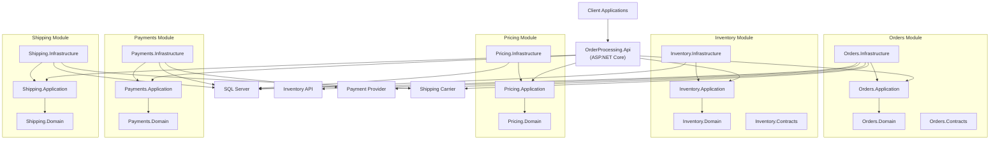
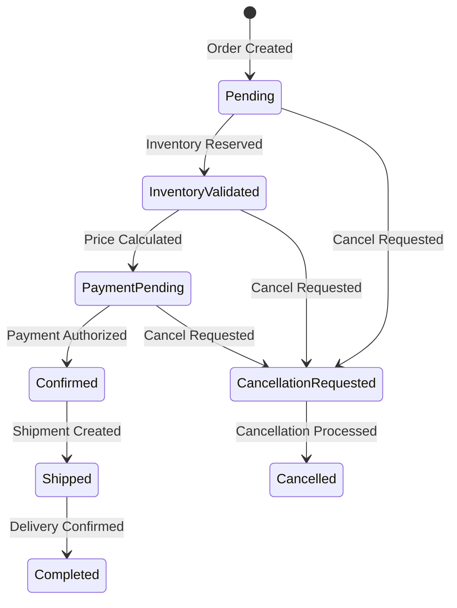
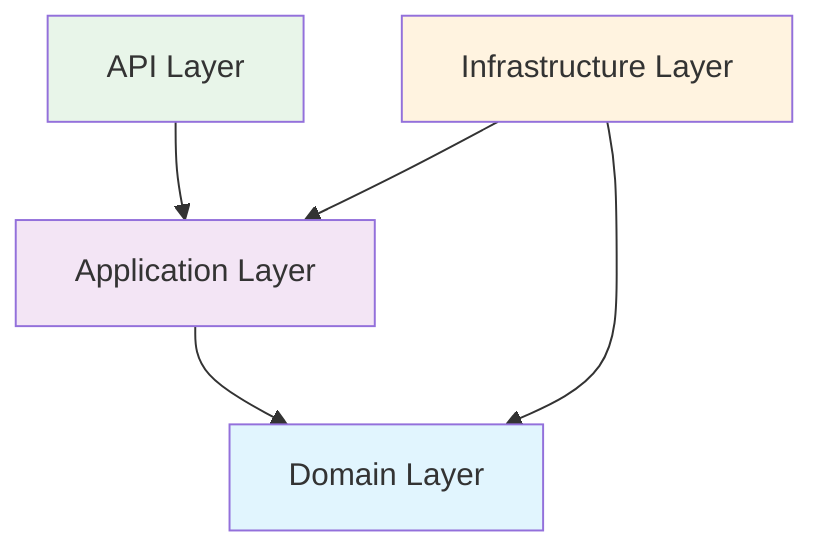
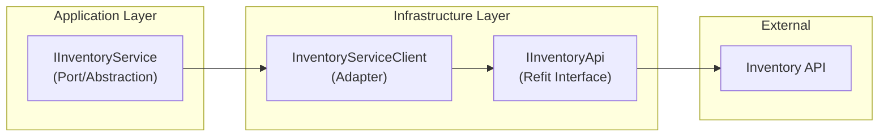

# Order Processing Platform

A production-oriented .NET 10 solution skeleton demonstrating **Modular Monolith** architecture with **Clean Architecture / Hexagonal Architecture** principles inside each module. Built as a Solution Architect assessment to show architectural thinking, module boundaries, dependency direction, contracts, testing strategy, integrations, observability, security, and maintainability.

This is an **implementation blueprint**, not a completed application. A development team can take this over and start implementing immediately.

## Architecture Overview



## Why Modular Monolith?

A **Modular Monolith** provides the module isolation benefits of microservices without the operational complexity of distributed systems. Each module has strong boundaries enforced by project structure and automated architecture tests. Modules can be extracted into independent services in the future by replacing in-process communication with messaging.

See [ADR-001: Modular Monolith Architecture](docs/adr/001-modular-monolith-architecture.md) for the full rationale.

## Order Lifecycle



## Dependency Rules



| Rule | Enforced By |
|------|-------------|
| Domain knows nothing about Infrastructure, API, or EF Core | NetArchTest |
| Application defines abstractions; Infrastructure implements them | Project references |
| Modules communicate only via Contracts (integration events) | NetArchTest |
| Controllers contain no business logic | Code review |
| No circular project references | Compiler |

## Integration Flow



The Application layer depends on an abstraction. Infrastructure implements it using Refit. The Application layer has **zero knowledge** that Refit exists.

## Technology Stack

| Category | Technology |
|----------|-----------|
| Runtime | .NET 10 |
| Web Framework | ASP.NET Core |
| Language | C# |
| ORM | Entity Framework Core |
| Database | SQL Server |
| HTTP Clients | Refit |
| Validation | FluentValidation |
| Logging | Serilog |
| Authentication | JWT Bearer |
| API Docs | OpenAPI + Swagger UI + Scalar |
| Testing | xUnit, FluentAssertions, NSubstitute |
| Architecture Testing | NetArchTest.eNhancedEdition |
| CQRS Mediation | MediatR |

## Solution Structure

```
OrderProcessing/
├── src/
│   ├── OrderProcessing.Api/              # ASP.NET Core host
│   ├── BuildingBlocks/
│   │   ├── BuildingBlocks.Domain/        # Base entities, value objects, domain events
│   │   ├── BuildingBlocks.Application/   # Envelope types, pipeline behaviors
│   │   ├── BuildingBlocks.Infrastructure/# BaseDbContext, outbox abstractions
│   │   └── BuildingBlocks.Contracts/     # Integration event marker
│   └── Modules/
│       ├── Orders/                       # Order lifecycle, aggregate, events
│       ├── Inventory/                    # Stock availability and reservation
│       ├── Pricing/                      # Product pricing and discounts
│       ├── Payments/                     # Payment processing
│       └── Shipping/                     # Shipment management
│           ├── {Module}.Domain/
│           ├── {Module}.Application/
│           ├── {Module}.Infrastructure/
│           └── {Module}.Contracts/
├── tests/
│   ├── OrderProcessing.UnitTests/        # Domain + validator tests
│   ├── OrderProcessing.IntegrationTests/ # WebApplicationFactory API tests
│   ├── OrderProcessing.ArchitectureTests/# Dependency rule enforcement
│   └── OrderProcessing.ContractTests/    # Envelope + integration event contracts
└── docs/
    ├── adr/                              # Architecture Decision Records
    └── architecture/                     # Deployment, logging, reliability docs
```

## Modules

| Module | Responsibility |
|--------|---------------|
| **Orders** | Order creation, retrieval, cancellation, lifecycle state transitions |
| **Inventory** | Stock availability, reservation, release |
| **Pricing** | Product pricing, taxes, discounts, total calculation |
| **Payments** | Payment authorization, status tracking, provider abstraction |
| **Shipping** | Shipment creation, tracking, carrier abstraction |

## Request / Response Envelope

All API endpoints use a standardized envelope:

### Request

```json
{
  "headers": {
    "correlationId": "550e8400-e29b-41d4-a716-446655440000",
    "requestId": "6ba7b810-9dad-11d1-80b4-00c04fd430c8",
    "source": "web-frontend",
    "channel": "online"
  },
  "payload": {
    "customerId": "...",
    "items": [...]
  }
}
```

### Successful Response

```json
{
  "payload": {
    "orderId": "..."
  },
  "exception": null
}
```

### Error Response

```json
{
  "payload": null,
  "exception": {
    "code": "ORDER_NOT_FOUND",
    "message": "Order was not found.",
    "details": []
  }
}
```

Authentication uses the standard HTTP `Authorization: Bearer <token>` header — **not** the request envelope.

## API Endpoints

| Method | Path | Description |
|--------|------|-------------|
| `POST` | `/api/orders` | Create a new order |
| `GET` | `/api/orders/{orderId}` | Retrieve order by ID |
| `POST` | `/api/orders/{orderId}/cancel` | Cancel an order |
| `POST` | `/api/inventory/reserve` | Reserve inventory |
| `GET` | `/api/inventory/availability/{sku}` | Check stock availability |
| `GET` | `/api/pricing/calculate?sku=...&quantity=...` | Calculate price |
| `POST` | `/api/payments/process` | Process a payment |
| `POST` | `/api/shipping/create` | Create a shipment |
| `GET` | `/health/live` | Liveness probe |
| `GET` | `/health/ready` | Readiness probe |

## Testing Strategy

| Level | Project | What It Tests | Tools |
|-------|---------|---------------|-------|
| **Unit** | `OrderProcessing.UnitTests` | Domain behavior, value objects, validators | xUnit, FluentAssertions, NSubstitute |
| **Integration** | `OrderProcessing.IntegrationTests` | API → Application → Infrastructure → Database | WebApplicationFactory, InMemory DB |
| **Architecture** | `OrderProcessing.ArchitectureTests` | Dependency rules, module boundaries | NetArchTest.eNhancedEdition |
| **Contract** | `OrderProcessing.ContractTests` | Envelope serialization, integration event structure | xUnit, FluentAssertions |

## How to Build

```bash
dotnet build
```

## How to Run

```bash
dotnet run --project src/OrderProcessing.Api
```

Access the API documentation:
- **Scalar API Reference**: http://localhost:5100/scalar/v1
- **Swagger UI**: http://localhost:5100/swagger
- **OpenAPI spec**: http://localhost:5100/openapi/v1.json

## How to Run Tests

```bash
# All tests
dotnet test

# Specific test level
dotnet test --filter "ArchitectureTests"
dotnet test --filter "UnitTests"
dotnet test --filter "ContractTests"
```

## Security

- JWT Bearer authentication with configurable authority and audience
- Authorization policies: `Orders.Read`, `Orders.Write`, `Orders.Cancel`
- No hardcoded secrets — all credentials from configuration/secret store
- Sensitive data (JWTs, passwords, payment details) is never logged

## Observability

- **Structured logging**: Serilog with console sink (dev) and configurable production sinks
- **Correlation**: `X-Correlation-Id` header propagated through all log entries
- **Request logging**: Every HTTP request logged with method, path, status, and elapsed time
- **Future**: OpenTelemetry for distributed tracing and metrics

## Reliability

- **Outbox pattern**: Reliable domain event publishing within database transactions
- **Idempotency**: `RequestId` prevents duplicate order creation
- **Resilience**: Retry, timeout, and circuit-breaker for external API calls (placeholder)
- **Compensating actions**: Failed downstream steps trigger rollback of previous steps

See [Reliability and Consistency](docs/architecture/reliability-consistency.md) for details.

## Future Evolution

The modular monolith is designed for future extraction into distributed services:

1. **Extract a module**: Move module projects to a separate solution, deploy independently
2. **Replace in-process calls**: Swap integration event handlers with message broker consumers
3. **Database per service**: Migrate module schema to a dedicated database
4. **API gateway**: Route requests to the appropriate service
5. **Outbox → Message Broker**: Already designed for reliable event delivery

The Contracts projects serve as the public API of each module — they remain stable regardless of internal changes.

## What Is Intentionally NOT Implemented

This is an **architectural skeleton**, not a completed system:

- Complete order state machine logic
- Real pricing/discount calculations
- Actual payment provider integration
- Real inventory management
- Shipping carrier API integration
- Full repository methods
- Complete MediatR pipeline behaviors
- Identity provider / token issuance
- Message broker / outbox background processor
- EF Core migrations
- Resilience policies (Polly)
- OpenTelemetry / distributed tracing
- Kubernetes manifests / Dockerfile

All business logic uses `throw new NotImplementedException()` or `// TODO:` comments.

## Architecture Decision Records

- [ADR-001: Modular Monolith Architecture](docs/adr/001-modular-monolith-architecture.md)
- [ADR-002: Clean Architecture and Dependency Direction](docs/adr/002-clean-architecture-and-dependency-direction.md)
- [ADR-003: External Integration Strategy](docs/adr/003-external-integration-strategy.md)
- [ADR-004: API Envelope and Error Handling](docs/adr/004-api-envelope-and-error-handling.md)
- [ADR-005: Order Consistency and Reliability](docs/adr/005-order-consistency-and-reliability.md)
