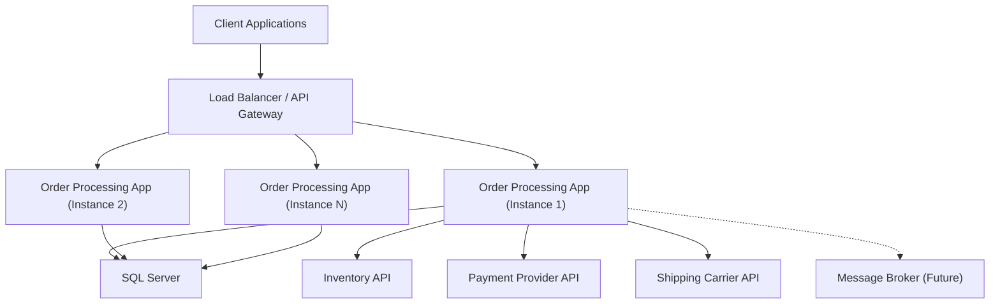

# Deployment Architecture

## Overview

The Order Processing Platform is deployed as a single ASP.NET Core application. It is stateless, horizontally scalable, and communicates with a SQL Server database and multiple external APIs.

## Architecture Diagram



## Key Principles

### Stateless API

The application stores no session state in-process. All state resides in SQL Server. Any instance can handle any request, enabling straightforward horizontal scaling behind a load balancer.

### Health Checks

| Endpoint | Purpose | Probes |
|----------|---------|--------|
| `/health/live` | Liveness | Process is running (always returns 200) |
| `/health/ready` | Readiness | Database connectivity, external service availability |

Kubernetes or load balancers should use liveness probes to detect stuck processes and readiness probes to route traffic only to healthy instances.

### Configuration

- **`appsettings.json`**: Default configuration, committed to source control (no secrets)
- **`appsettings.{Environment}.json`**: Environment-specific overrides
- **Environment variables**: Runtime overrides (connection strings, API keys)
- **Secret store**: Azure Key Vault, AWS Secrets Manager, or HashiCorp Vault for credentials

All configuration uses the Options pattern with strongly-typed classes.

### Containerization

```dockerfile
# Example Dockerfile (not included in skeleton — add when ready for deployment)
FROM mcr.microsoft.com/dotnet/aspnet:10.0 AS base
FROM mcr.microsoft.com/dotnet/sdk:10.0 AS build
# Build and publish steps
```

### CI/CD Pipeline

A production CI/CD pipeline should include:

1. **Build**: `dotnet build --configuration Release`
2. **Test**: `dotnet test --configuration Release --no-build`
3. **Architecture tests**: Validate dependency rules as a CI gate
4. **Publish**: `dotnet publish --configuration Release`
5. **Container build**: Docker image with multi-stage build
6. **Deploy**: Rolling update to staging, then production

### Database Strategy

Each module uses a separate SQL Server schema within the same database:

| Module | Schema |
|--------|--------|
| Orders | `orders` |
| Inventory | `inventory` |
| Pricing | `pricing` |
| Payments | `payments` |
| Shipping | `shipping` |

This provides logical separation while sharing a single database instance. If modules are later extracted into services, each can migrate to its own database.

### Secrets Management

- Connection strings with credentials: stored in secret manager, injected via environment variables
- JWT signing keys: managed by the identity provider, not stored in the application
- External API keys: stored in secret manager, injected at runtime
- **Never** committed to source control
