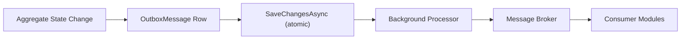

# Reliability and Consistency

## Overview

The Order Processing Platform handles operations that span internal state changes and external service calls. This document describes the patterns used to ensure data consistency, handle failures, and provide reliable event delivery.

## Transaction Boundaries

Each module owns its own `DbContext` and database schema. Transactions are scoped to a single module's `DbContext.SaveChangesAsync()` call.

**Rule:** A single database transaction never spans multiple modules. Cross-module consistency is achieved through integration events and eventual consistency.

```
┌─────────────────────────────────────────────┐
│ Single Transaction Boundary                  │
│                                              │
│  1. Modify Order aggregate                   │
│  2. Add OutboxMessage for domain event       │
│  3. SaveChangesAsync() — atomic commit       │
│                                              │
└─────────────────────────────────────────────┘
         │
         ▼ (async, eventually consistent)
┌─────────────────────────────────────────────┐
│ Outbox Processor (background)                │
│                                              │
│  1. Read unprocessed OutboxMessages          │
│  2. Publish to message broker                │
│  3. Mark as processed                        │
│                                              │
└─────────────────────────────────────────────┘
```

## Idempotency

### Order Creation

Every request includes a `RequestId` in the envelope headers. This serves as an idempotency key.

**Flow:**

1. Receive `CreateOrderCommand` with `RequestId`
2. Check if an order with this `RequestId` already exists
3. If yes, return the existing order (no duplicate creation)
4. If no, create the order and store the `RequestId`

**Implementation location:** `CreateOrderCommandHandler` in Orders.Application.

```
// TODO: Implement idempotency store
// Options:
// - Dedicated IdempotencyKey table with RequestId + Response + ExpiresAt
// - Check before command execution, store after successful execution
// - Expire old keys after a configurable TTL (e.g., 24 hours)
```

## Outbox Pattern

Domain events are published reliably using the Outbox Pattern:



The `OutboxMessage` entity stores:

| Field | Type | Purpose |
|-------|------|---------|
| `Id` | `Guid` | Unique message identifier |
| `Type` | `string` | Fully-qualified event type name |
| `Content` | `string` | Serialized event payload (JSON) |
| `OccurredOnUtc` | `DateTimeOffset` | When the event was raised |
| `ProcessedOnUtc` | `DateTimeOffset?` | When the message was published (null = pending) |

## External API Resilience

Each external API client (Inventory, Payment, Shipping) should be configured with:

| Policy | Configuration | Purpose |
|--------|---------------|---------|
| **Timeout** | Per-provider SLA (e.g., 30s) | Prevent hanging requests |
| **Retry** | Exponential backoff, 3 attempts | Handle transient failures |
| **Circuit Breaker** | Open after 5 failures in 30s, half-open after 60s | Prevent cascade failures |

```csharp
// TODO: Configure resilience policies per HttpClient
// Use Microsoft.Extensions.Http.Resilience or Polly
// Example:
// builder.Services.AddRefitClient<IPaymentGatewayApi>()
//     .ConfigureHttpClient(c => c.BaseAddress = new Uri(options.BaseUrl))
//     .AddStandardResilienceHandler();
```

## Partial Failure Handling

The order creation flow involves multiple steps. If a downstream step fails, compensating actions restore consistency:

| Step | Failure | Compensation |
|------|---------|--------------|
| Inventory reservation | Payment fails | Release reserved inventory |
| Payment authorization | Shipping creation fails | Refund payment, release inventory |
| Shipment creation | — | Final step; failure triggers order status → `Failed` |

The `CreateOrderCommandHandler` implements this as a sequential orchestration with try/catch compensation (not a separate saga framework).

## Eventual Consistency

Cross-module operations are eventually consistent:

1. Orders module confirms an order → publishes `OrderConfirmedIntegrationEvent` via outbox
2. Shipping module receives the event → creates a shipment
3. Brief delay (seconds to minutes) between order confirmation and shipment creation

Consumers must be designed for:

- **At-least-once delivery**: Handle duplicate events idempotently
- **Out-of-order delivery**: Use event timestamps and sequence numbers
- **Delayed delivery**: Do not assume immediate consistency across modules
